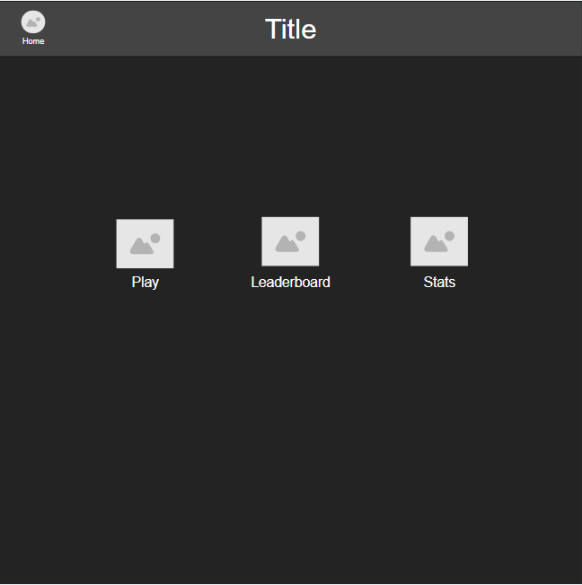
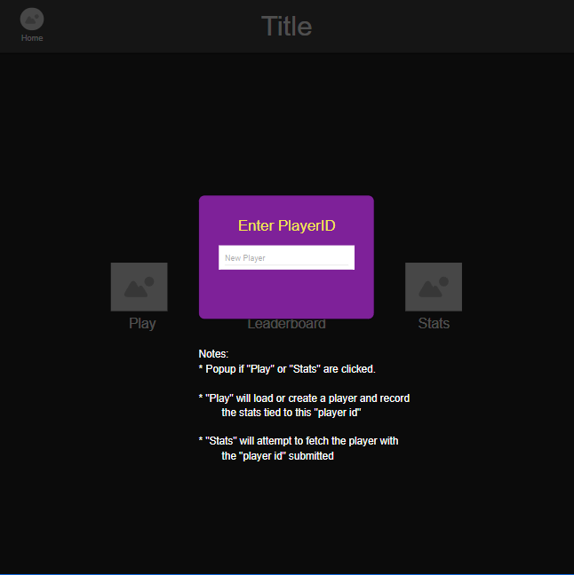
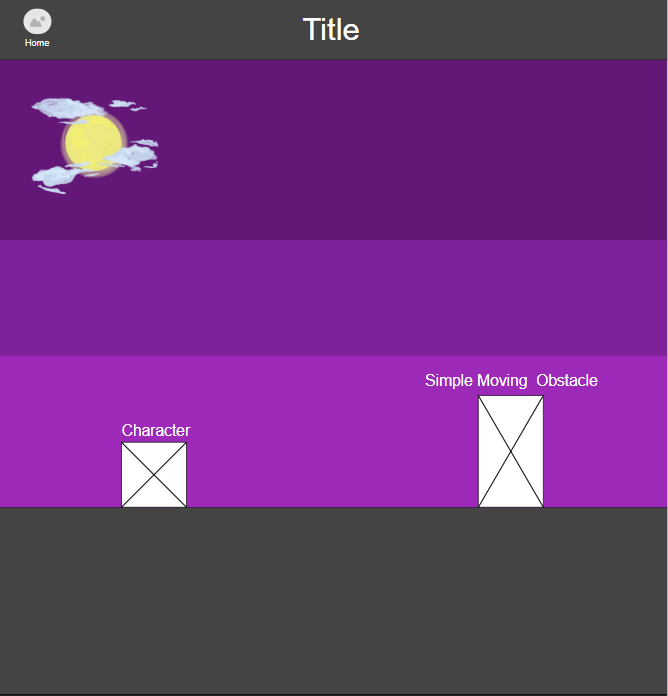
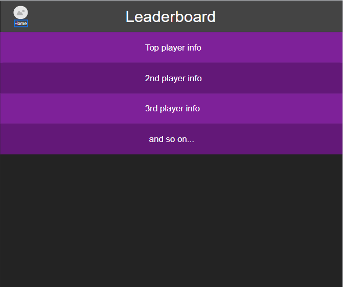
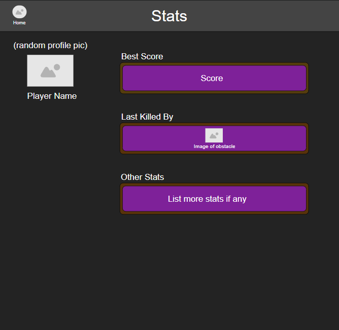

# CS408 Final Project

## Project Spec

### General Theme

Endless runner web game with a competitive aspect.

### Functionality

This game will start off as your typical endless runner game, similar to that of google's, when you have no interenet and you are able to start an endless runner playing as the dinosaur. Inheritely, there isn't much that it offers, except (hopefully) fun and enjoyment as a past-time. For our competitive players, there is a leaderboard of all concurrent and past players to raise in the ranks, as well as a player stat page to view individual profiles and statistics.

### Audience

The audience is going to be the general public here. This isn't intended to be a very complicated game, but one that is simple, engaging, and eventually challenging. Those who enjoy a past-time game, while being able to compete with others with little to no effort in managing a profile login, then this is the perfect match!

### Data Management

The idea is to have each player have, but not limited to, one player id to which they can use to record their stats. Meaning every time a user enters their player ID, they may play as that profile and the stats will be recorded after a play session. As for the actual data, there should be a high score, player id (username), last obstacle hit, and possibly a "last score" which would be there most recent play session's score. All this data will be fetched for leaderboard placement, or profile stats. In the later section `Future Implmentations`, based on which features get implemented, the database could be altered to store different data such as time or images.

### Future Implementations

- Time tracking
- Speed increase relative to time survived
- Reasonable obstacle generation (no impossible situations for the player)
- Create enemies (moving obstacles)
- Customizable characters
- Character as a profile picture
  
#### Time Tracking and Speed Increase

- The timer should be simple, in that every 60 seconds should convert to a minute and every 60 minutes should convert to an hour --- updating dynamically during play. I could simply have the counter increment without conversion, but then this might get confused with the points. If there is not much time, this might not be seen in the final version.
- Every so seconds, the speed of the obstacles moving and, eventually, the amount of the obstacles should also increase a considerable amount. As this will be based on the timer, it being in the final version is dependent on the former.

#### Obstacle Generation and Enemies

Whether the difficulty increases, or if the game eventually has enemies alongside obstacles, I want to be sure that the obstacles and enemies never generate in an "impossible" pattern, which could be limited by the character's movement, or obstacles blocking the entire height of the playing field---fairness is key.

#### Customizable Characters

I'll start with the player being able to pick from a handful of given characters, and potentially move on to custom ones if time permits. I plan to do this by having the user upload an image that they've found as the "sprite" or character. Animation for the characters is still unclear, so it might be a static image with movement and no additional animation.

#### Character as a profile

Varying profile pictures based on your character selection may be dependent on `Customizable Character` implementation, and whether I can get that stored and retrieved from the database as a blob is going to determine if this feature can make it into the final version. Otherwise, it would simply use the recorded character selected in the database as the profile picture in both the leaderboard and the player stat page.

### Notes From the Author

The Minimum Viable Product (MVP) should be feasible as most of the time consuming implementation have practically been settled. Things such as collision detection, data storage, data retrieval, and animation, have all been seen previously all, but also would have been my greatest obstacles during this project --- they will still be. Therefore, going beyond the MVP alongside other priorities will be challenging for the time given, but I am hoping to get at least two of those `Future Implementations` pushed to the final version!

## Project Wireframe

  
  
  
  
  
